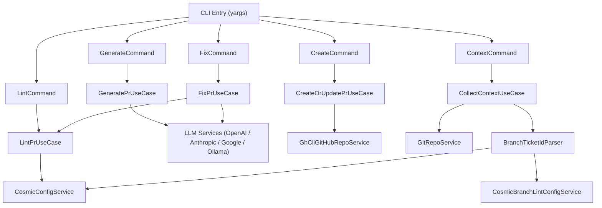
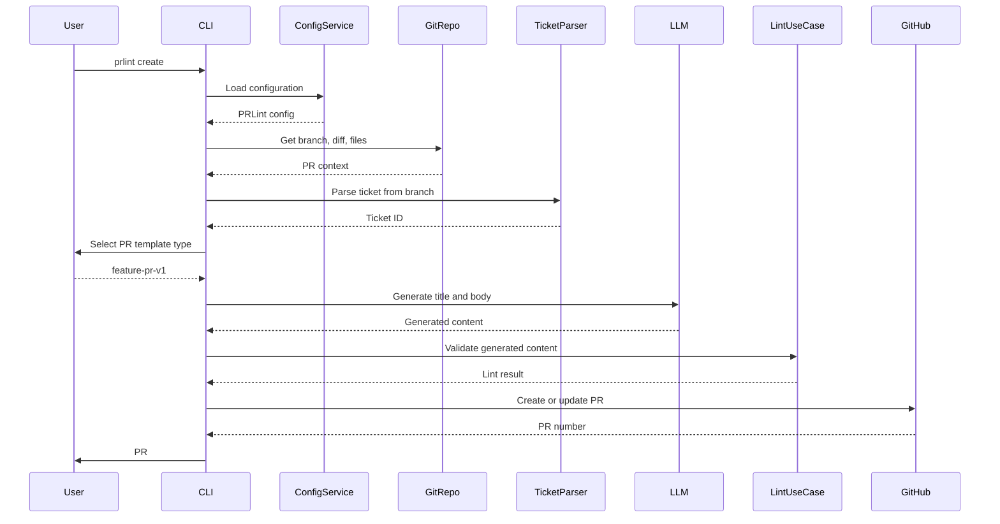

<a id="top"></a>

<p align="center">
  
</p>

<h1 align="center">🔍 PRLint</h1>
<p align="center"><em>AI-powered pull request linting, generation, and create-or-update CLI — enforce consistent PR quality across your entire team</em></p>

<p align="center">
    <a aria-label="ElsiKora logo" href="https://elsikora.com">
  
</a>          
</p>

## 💡 Highlights

- 🤖 AI-powered PR generation with multi-provider support (OpenAI, Anthropic, Google, Ollama) — generate, validate, and auto-fix PRs from your diff
- ✅ Deterministic lint rules for title format, required body sections, forbidden placeholders, and branch-ticket correlation
- 🔄 Idempotent create-or-update workflow — one command to generate content and push it to GitHub via `gh` CLI
- ⚙️ Zero-config defaults with deep customization via cosmiconfig — works out of the box, adapts to any team convention

## 📚 Table of Contents

- [Description](#-description)
- [Tech Stack](#-tech-stack)
- [Features](#-features)
- [Architecture](#-architecture)
- [Project Structure](#-project-structure)
- [Prerequisites](#-prerequisites)
- [Installation](#-installation)
- [Usage](#-usage)
- [Roadmap](#-roadmap)
- [FAQ](#-faq)
- [License](#-license)
- [Acknowledgments](#-acknowledgments)

## 📖 Description

PRLint is a standalone CLI tool that brings deterministic quality enforcement to your pull request workflow. It validates PR titles against conventional patterns, ensures body sections are present and ordered, catches forgotten placeholders, and correlates ticket IDs from branch names — all before your code ever reaches review.

But PRLint goes beyond static linting. Powered by multi-provider LLM integration (OpenAI, Anthropic, Google, Ollama), it can **generate** complete PR titles and bodies from your git diff, **validate** them against your configured rules, and **iteratively fix** any violations — all in a single command. The `create` command ties it all together by pushing the result directly to GitHub as a new or updated pull request.

### Real-World Use Cases

- **Engineering teams** enforcing a consistent PR template across 50+ contributors — no more missing "Test Plan" sections or leftover `TODO` placeholders
- **Solo developers** who want high-quality PRs without the manual overhead — let AI generate structured content from your diff
- **CI/CD pipelines** that gate merges on PR quality — use `prlint lint --json` as a GitHub Actions check
- **Regulated environments** where every PR must reference a ticket ID and include risk assessment sections
- **Open source maintainers** who want contributor PRs to follow a predictable format without lengthy contribution guides

Built with clean architecture principles (Domain → Application → Infrastructure → Presentation), PRLint is fully configurable via cosmiconfig, supports human and JSON output modes, and integrates seamlessly with existing `git-branch-lint` configurations for ticket extraction.

## 🛠️ Tech Stack

| Category            | Technologies                                         |
| ------------------- | ---------------------------------------------------- |
| **Language**        | TypeScript, JavaScript                               |
| **Runtime**         | Node.js                                              |
| **Build Tool**      | Rollup, TypeScript Compiler                          |
| **Testing**         | Vitest, V8 Coverage                                  |
| **Linting**         | ESLint, Prettier                                     |
| **CI/CD**           | GitHub Actions, Semantic Release, Husky, lint-staged |
| **Package Manager** | npm                                                  |
| **LLM Providers**   | OpenAI, Anthropic (Claude), Google (Gemini), Ollama  |
| **Configuration**   | cosmiconfig                                          |
| **CLI**             | yargs, chalk, ora, prompts                           |

## 🚀 Features

- ✨ \***\*Title pattern validation** — enforce conventional commit-style PR titles with regex patterns including named capture groups for type, scope, subject, and ticket\*\*
- ✨ \***\*Required body sections** — ensure PRs contain all mandatory sections (Summary, Changes, Test Plan, etc.) in the correct order\*\*
- ✨ \***\*Forbidden placeholder detection** — catch leftover WIP, TODO, template artifacts, and HTML comments before they reach review\*\*
- ✨ \***\*Branch-ticket correlation** — automatically extract ticket IDs from branch names and validate they appear in the PR title/body\*\*
- ✨ \***\*Multi-provider AI generation** — generate complete PR content using OpenAI (GPT-4o/5), Anthropic (Claude), Google (Gemini), or local Ollama models\*\*
- ✨ \***\*Iterative fix workflow** — generate → lint → fix loop that retries until the output passes all rules or hits the retry limit\*\*
- ✨ \***\*Idempotent create-or-update** — create a new GitHub PR or update an existing one in a single command via `gh` CLI\*\*
- ✨ \***\*Template-aware generation** — select from bugfix, feature, or release PR templates with template-specific required sections\*\*
- ✨ \***\*Dual output modes** — human-readable colored terminal output or structured JSON for CI/CD pipeline integration\*\*
- ✨ \***\*Interactive LLM configuration** — guided setup wizard for provider, model, and API key configuration with environment variable support\*\*
- ✨ \***\*git-branch-lint integration** — reuse existing branch naming rules for ticket extraction with optional placeholder support\*\*
- ✨ \***\*Configurable ticket normalization** — preserve, uppercase, or lowercase ticket IDs for consistent comparison\*\*
- ✨ \***\*Clean architecture** — Domain-Driven Design with strict layer boundaries, dependency injection, and full interface abstraction\*\*
- ✨ \***\*Comprehensive test suite** — unit tests covering use cases, value objects, policies, and infrastructure services\*\*

## 🏗 Architecture

### System Architecture



### Data Flow



## 📁 Project Structure

<details>
<summary>Click to expand</summary>

```
PRLint/
├── .github/
│   ├── workflows/
│   │   ├── mirror-to-codecommit.yml
│   │   ├── qodana-quality-scan.yml
│   │   ├── release.yml
│   │   ├── snyk-security-scan.yml
│   │   └── test.yml
│   └── dependabot.yml
├── bin/
│   ├── application/
│   │   ├── constant/
│   │   ├── interface/
│   │   └── use-case/
│   ├── domain/
│   │   ├── constant/
│   │   ├── entity/
│   │   ├── enum/
│   │   ├── interface/
│   │   ├── policy/
│   │   └── value-object/
│   ├── infrastructure/
│   │   ├── di/
│   │   ├── git/
│   │   ├── github/
│   │   ├── llm/
│   │   └── service/
│   ├── presentation/
│   │   ├── cli/
│   │   └── presenter/
│   ├── cli.d.ts
│   ├── cli.js
│   ├── cli.js.map
│   └── index.d.ts
├── docs/
│   ├── architecture/
│   │   └── naming-and-parity.md
│   └── config.md
├── research/
│   ├── commitlint-ai-architecture.md
│   ├── git-branch-lint-rules.md
│   └── prlint-design-decisions.md
├── src/
│   ├── application/
│   │   ├── constant/
│   │   ├── interface/
│   │   └── use-case/
│   ├── domain/
│   │   ├── constant/
│   │   ├── entity/
│   │   ├── enum/
│   │   ├── interface/
│   │   ├── policy/
│   │   ├── type/
│   │   └── value-object/
│   ├── infrastructure/
│   │   ├── config/
│   │   ├── di/
│   │   ├── git/
│   │   ├── github/
│   │   ├── llm/
│   │   ├── service/
│   │   └── ticket/
│   ├── presentation/
│   │   ├── cli/
│   │   ├── handler/
│   │   └── presenter/
│   ├── cli.ts
│   └── index.ts
├── test/
│   └── unit/
│       ├── application/
│       ├── domain/
│       ├── infrastructure/
│       └── presentation/
├── commitlint.config.js
├── eslint.config.js
├── generated-logo.png
├── lint-staged.config.js
├── package-lock.json
├── package.json
├── prettier.config.js
├── README.md
├── release.config.js
├── rollup.config.js
├── rollup.test.config.js
├── tsconfig.build.json
├── tsconfig.json
├── vitest.e2e.config.js
└── vitest.unit.config.js
```

</details>

## 📋 Prerequisites

- Node.js >= 18.0.0
- npm >= 9.0.0
- Git (installed and repository initialized)
- GitHub CLI (`gh`) — required for the `create` command
- API key for at least one LLM provider (OpenAI, Anthropic, Google) or a local Ollama instance — required for `generate`, `create`, and `fix` commands

## 🛠 Installation

```bash
# Install globally
npm install -g @elsikora/prlint

# Or as a dev dependency in your project
npm install --save-dev @elsikora/prlint

# Verify installation
prlint --help


### Prerequisites for GitHub Integration

The `create` command requires the [GitHub CLI](https://cli.github.com/) to be installed and authenticated:


# Install GitHub CLI (macOS)
brew install gh

# Authenticate
gh auth login


### LLM Provider Setup

Set the API key for your preferred provider:


# OpenAI
export OPENAI_API_KEY="sk-..."

# Anthropic
export ANTHROPIC_API_KEY="sk-ant-..."

# Google
export GOOGLE_API_KEY="AIza..."

# Ollama (local, no key needed by default)
export OLLAMA_BASE_URL="http://localhost:11434"
```

## 💡 Usage

### Quick Start

```bash
# Lint the current PR against configured rules
prlint lint

# Generate a PR title and body from the current diff
prlint generate

# Generate and push a PR to GitHub in one step
prlint create

# Generate, lint, and auto-fix until passing
prlint fix

# Display collected PR context (branch, diff, ticket)
prlint context
```

### Commands

#### `prlint lint`

Validates the current PR against all configured rules — title format, body sections, forbidden placeholders, and ticket correlation.

```bash
# Human-readable output
prlint lint

# JSON output for CI pipelines
prlint lint --json
```

Example output:

```
✘ PR lint failed — 2 issue(s)
────────────────────────────────────────
  • [title_format] Title "" does not match pattern
  • [body_sections_order] Missing required section: ## Summary
```

#### `prlint generate`

Generates a PR title and body from the current diff using your configured LLM provider, then validates the output.

```bash
prlint generate
prlint generate --json
```

#### `prlint create`

Full workflow: select a template type → generate content → validate → create or update a GitHub PR.

```bash
prlint create
prlint create --json
```

The command is **idempotent** — if a PR already exists for the current branch, it updates the title and body instead of creating a duplicate.

#### `prlint fix`

Generates content, lints it, and iteratively regenerates with lint feedback until the output passes or the retry limit is reached.

```bash
prlint fix
prlint fix --json
```

#### `prlint context`

Displays the PR context that PRLint collects internally — useful for debugging.

```bash
prlint context
prlint context --json
```

### Configuration

Create `.elsikora/prlint.config.js` in your repository root:

```javascript
export default {
	github: {
		base: "dev",
		draft: false,
		prohibitedBranches: ["main", "master"],
	},
	generation: {
		provider: "anthropic",
		model: "claude-sonnet-4-20250514",
		retries: 3,
		validationRetries: 3,
	},
	lint: {
		titlePattern: "^(?<type>[a-z]+)\\((?<scope>[a-z0-9-]+)\\): (?<subject>.+) \\| (?<ticket>[A-Za-z]{2,}-\\d+)$",
		requiredSections: ["Summary", "Scope", "Changes", "Acceptance Criteria", "Test Plan", "Risks", "Linear"],
		forbiddenPlaceholders: ["WIP", "TODO", "<!--", "TEMPLATE", "lorem ipsum", "[ ]", "<replace-me>"],
	},
	ticket: {
		source: "auto",
		pattern: "[a-z]{2,}-[0-9]+",
		patternFlags: "i",
		normalization: "preserve",
		missingBranchLintBehavior: "fallback",
	},
};
```

### Ticket Extraction Strategies

| Source        | Behavior                                                         |
| ------------- | ---------------------------------------------------------------- |
| `auto`        | Try `branch-lint` first, fall back to `pattern`                  |
| `branch-lint` | Use `@elsikora/git-branch-lint` rules with `:ticket` placeholder |
| `pattern`     | Apply regex directly to branch name                              |
| `none`        | Disable ticket extraction                                        |

### PR Template Types

The `create` command supports three template types with different required sections:

| Template        | Sections                                                                                      |
| --------------- | --------------------------------------------------------------------------------------------- |
| `feature-pr-v1` | Summary, Scope, Implementation, Acceptance Criteria, Test Plan, Rollout, Linear               |
| `bugfix-pr-v1`  | Summary, Root Cause, Changes, Acceptance Criteria, Test Plan, Risks & Rollback, Linear        |
| `release-pr-v1` | Release Scope, Included Changes, Breaking Changes, Migrations, Verification, Rollback, Linear |

### CI/CD Integration

Use the `--json` flag in GitHub Actions:

```yaml
- name: Lint PR
  run: npx prlint lint --json
  env:
    GITHUB_TOKEN: ${{ secrets.GITHUB_TOKEN }}
```

### Environment Variables

| Variable            | Purpose                            |
| ------------------- | ---------------------------------- |
| `OPENAI_API_KEY`    | API key for OpenAI provider        |
| `ANTHROPIC_API_KEY` | API key for Anthropic provider     |
| `GOOGLE_API_KEY`    | API key for Google provider        |
| `OLLAMA_BASE_URL`   | Base URL for local Ollama instance |

## 🛣 Roadmap

<details>
<summary>Click to expand</summary>

| Task / Feature                                                       | Status         |
| -------------------------------------------------------------------- | -------------- |
| Core lint engine (title, sections, placeholders, ticket correlation) | ✅ Done        |
| Multi-provider LLM generation (OpenAI, Anthropic, Google, Ollama)    | ✅ Done        |
| Idempotent create-or-update via `gh` CLI                             | ✅ Done        |
| Iterative fix workflow with retry limits                             | ✅ Done        |
| Template-aware PR generation (bugfix, feature, release)              | ✅ Done        |
| git-branch-lint integration for ticket extraction                    | ✅ Done        |
| Human and JSON output modes                                          | ✅ Done        |
| Interactive LLM configuration wizard                                 | ✅ Done        |
| Comprehensive unit test suite                                        | ✅ Done        |
| Enhanced AI system prompt with template-specific context             | 🚧 In Progress |
| GitHub Actions reusable workflow for PR linting                      | 🚧 In Progress |
| Custom rule plugin system for extensible lint policies               | 🚧 In Progress |
| PR body diff-aware section updating (partial regeneration)           | 🚧 In Progress |

</details>

## ❓ FAQ

<details>
<summary>Click to expand</summary>

### ❓ Do I need an LLM API key to use PRLint?

**No.** The `lint` and `context` commands work entirely offline with no API key required. Only the `generate`, `create`, and `fix` commands require an LLM provider. You can also use a local Ollama instance for fully offline AI generation.

### ❓ How does PRLint differ from Danger.js or other PR tools?

PRLint is purpose-built for PR content quality — it validates title format, body structure, ticket correlation, and placeholder artifacts. Unlike Danger.js (which is a general-purpose automation framework), PRLint also **generates** PR content using AI and can create/update PRs directly. It's a single tool that covers the entire PR authoring workflow.

### ❓ Can I use PRLint without the GitHub CLI (`gh`)?

Yes, for everything except the `create` command. The `lint`, `generate`, `fix`, and `context` commands only need a local git repository. The `create` command uses `gh` to interact with the GitHub API.

### ❓ How does ticket extraction work with branch names like `feature/ABC-123-add-login`?

PRLint supports multiple extraction strategies. In `auto` mode (default), it first checks if you have `@elsikora/git-branch-lint` configured with a `:ticket` placeholder pattern. If not, it falls back to a regex pattern (default: `[a-z]{2,}-[0-9]+`) applied to the branch name. The extracted ticket is then validated against the PR title and body.

### ❓ Can I customize which sections are required in the PR body?

Absolutely. Set `lint.requiredSections` in your config to any array of section names, or set it to an empty array to disable section validation entirely.

### ❓ Does PRLint support monorepo setups?

PRLint reads configuration from the repository root via cosmiconfig. In a monorepo, place your `.elsikora/prlint.config.js` at the root. The tool operates on the current git branch and its diff against the configured base branch, which works naturally in monorepo workflows.

### ❓ How do I use PRLint in CI/CD?

Use the `--json` flag for machine-readable output. PRLint sets `process.exitCode = 1` when lint fails, so it integrates naturally with CI pipelines:

```yaml
- run: npx prlint lint --json
```

### ❓ Can I use a local LLM instead of cloud providers?

Yes! PRLint supports [Ollama](https://ollama.ai/) for fully local AI generation. Install Ollama, pull a model like `llama3.3`, and configure PRLint to use the `ollama` provider.

</details>

## 🔒 License

This project is licensed under **MIT**.

## 🙏 Acknowledgments

- Built with [yargs](https://yargs.js.org/) for CLI parsing, [chalk](https://github.com/chalk/chalk) for terminal styling, [ora](https://github.com/sindresorhus/ora) for spinners, and [prompts](https://github.com/terkelg/prompts) for interactive input
- Configuration discovery powered by [cosmiconfig](https://github.com/cosmiconfig/cosmiconfig)
- LLM integrations via [OpenAI SDK](https://github.com/openai/openai-node), [Anthropic SDK](https://github.com/anthropics/anthropic-sdk-typescript), and [Google Generative AI SDK](https://github.com/google/generative-ai-js)
- Dependency injection via [@elsikora/cladi](https://github.com/ElsiKora/cladi)
- Architecture inspired by Clean Architecture principles and conventions from [@elsikora/commitizen-plugin-commitlint-ai](https://github.com/ElsiKora/Commitizen-Plugin-Commitlint-AI) and [@elsikora/git-branch-lint](https://github.com/ElsiKora/Git-Branch-Lint)
- Ticket extraction strategies designed for seamless interoperability with `git-branch-lint` branch naming rules

---

<p align="center">
  <a href="#top">Back to Top</a>
</p>
